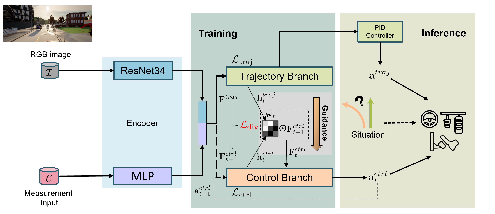

# Diversity-Enhanced TCP (DTCP)

<p align="center">
  
</p>

This repository contains the official code for the paper **Interpretable Decision-Making for End-to-End Autonomous Driving**


## Status

The code will be fully published by April 12, 2026.

## Citation
If you use this work, please cite:
If you use this work, please cite:
```bibtex
@inproceedings{mirzaie2025interpretable,
  title={Interpretable decision-making for end-to-end autonomous driving},
  author={Mirzaie, Mona and Rosenhahn, Bodo},
  booktitle={Proceedings of the IEEE/CVF International Conference on Computer Vision},
  pages={794--804},
  year={2025}
}
```
